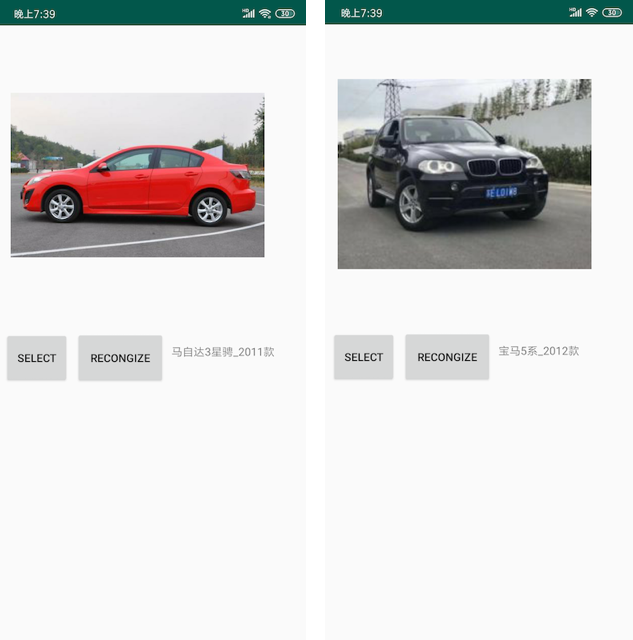

# HyperVID
基于深度学习移动端车型识别，支持超过4000种常见车辆品牌及子品牌。停车场卡口跟二手车图片TOP1准确率85%左右，TOP5 99%以上，新版优化了交通卡口的识别率，增加了车型种类。使用者可以基于我们的框架进行修改，后续我们会进一步优化模型，提高准确率与速度，并丰富类型库。

Vehicle Type Identification which supporting for 1776 kinds of models. Part of Data from Second-hand car trading service website.

[Models Table](label.txt)

#### 更新

- 提交新版模型，对交通卡口适应性更好，支持货车、客车、卡车等。

- 开放自然场景训练数据集，包含分类整理好的1776种车型，大约30万张图像。

- 链接: https://pan.baidu.com/s/1ZtXvjwLzIMQodEp3SAbN8g 提取码: byhy （如果您采用该数据集或者我们的工程，请在项目中说明，谢谢。）

#### 特性

- 速度快，基于mobilenet设计，更适合移动端部署

- 种类丰富，能够支持超过4000种常见车型

- 准确度高，TOP1 准确率超过85%

- 非常适合停车场卡口、交通卡口，结合车牌识别一同部署

#### 识别测试

- 在线体验: [http://www.zeusee.com/#/vehicle-recognition](http://www.zeusee.com/#/vehicle-recognition)

- 开源项目 Android APP：[http://demo.zeusee.com/HyperVID](http://demo.zeusee.com/HyperVID)

- 开源项目 Windows 测试程序: (链接: https://pan.baidu.com/s/1h7DNck9pFQo_rmg04IbXjw 提取码: 7h45)

#### Demo Image on Android

#### Related Dataset

[BIT-Vehicle Dataset](http://iitlab.bit.edu.cn/mcislab/vehicledb/)

[MIT Cars Dataset](https://ai.stanford.edu/~jkrause/cars/car_dataset.html)

[The CompCars dataset](http://mmlab.ie.cuhk.edu.hk/datasets/comp_cars/index.html)

##### 欢迎加我们的交流群 QQ:737677707, 备注:HyperDL
